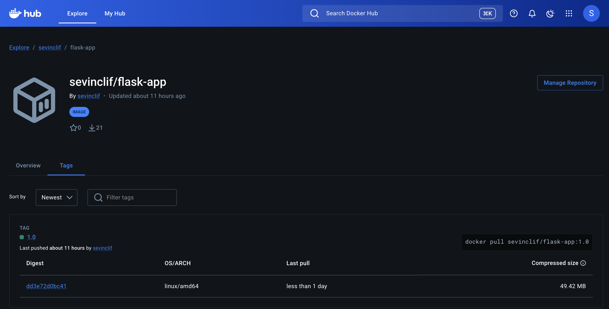

# Flask + MongoDB Kubernetes Deployment

## Overview

This project is based on a simple Flask application with MongoDB, extended with Docker, Kubernetes, Helm, and a CI pipeline.

The main purpose is to demonstrate how a basic application can be containerized, deployed to Kubernetes, and integrated with a CI workflow.

---

## Technologies

- Docker
- Kubernetes (Minikube)
- Helm
- GitHub Actions
- Flask
- MongoDB

---

## Prerequisites

To run this project locally, the following tools must be installed:

- Docker (for containerization)
- Minikube (for running a local Kubernetes cluster)
- kubectl (to interact with the cluster)
- Helm (for managing Kubernetes resources)

---

## Docker

To build the image locally:

```bash
docker build -t flask-app .
```

---

## Docker Compose

The application can also be run locally using Docker Compose.

To start both the Flask application and MongoDB:

```bash
docker compose up
```

This will start all required services for local development.

---

## Kubernetes

This project uses Minikube as a local Kubernetes cluster.

To start the cluster, you can run:

```bash
./setup-minikube.sh
```

This script will:

- Start Minikube
- Verify that the cluster is running

---

## Helm

The application and database are deployed using Helm. The Helm chart was created based on the initial Kubernetes manifests located in the `k8s/` directory.

Install:

```bash
helm install flask-app ./flask-app-chart
```

Upgrade:

```bash
helm upgrade flask-app ./flask-app-chart
```

---

## Access

The Flask application is exposed using a NodePort service.

To access the application, run:

```bash
minikube service flask-service
```

This will open the application in your browser.

MongoDB is deployed as an internal service and is not exposed externally.

---

## CI Pipeline

A GitHub Actions pipeline is configured in:

```bash
.github/workflows/ci.yml
```

The pipeline is triggered on each push and performs the following steps:

- Checks out the repository code
- Builds the Docker image
- Authenticates with Docker Hub
- Pushes the image to Docker Hub
- Installs Helm
- Validates the Helm chart configuration
- Renders Helm templates to verify correctness

---

## Docker Image

The image is available on Docker Hub:

```bash
sevinclif/flask-app:1.0
```



---

## Summary

In this project, I implemented a complete workflow starting from a basic Flask application to a containerized and deployable system.

The application was:
- Containerized using Docker
- Deployed to Kubernetes using Helm
- Integrated with a CI pipeline using GitHub Actions
- Published to Docker Hub for external access

This setup demonstrates a simplified but realistic DevOps pipeline.